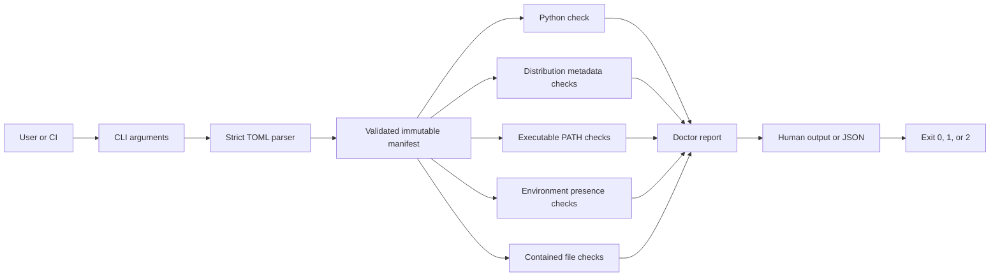

# Architecture

Samsarix Platform Doctor is a single-process, local Python CLI. Its job is to turn a small project manifest into bounded readiness results; it does not run the declared application.

## Data flow



## Package layout

```text
src/samsarix_platform/
├── __init__.py   package version
├── __main__.py   python -m entry point
├── cli.py        argument parsing, rendering, init, exit behavior
├── doctor.py     read-only checks and report model
├── manifest.py   strict schema parser and data model
└── py.typed      typed-package marker
```

`manifest.py` owns syntax and structural validity. Once loaded, the rest of the package receives frozen dataclasses rather than untyped TOML objects.

`doctor.py` owns check semantics. Each check returns one `pass`, `warn`, or `fail` result and optional remediation. Required missing items fail; optional missing items warn. Warnings become non-ready only under strict mode.

`cli.py` owns interaction. It maps a valid report to exit `0` or `1`, maps manifest/usage errors to exit `2`, and renders the same report as human text or JSON. `init` is the only write path and uses exclusive creation.

For `init`, a relative user-selected destination is joined lexically to the current directory without resolving the destination itself. Its parent must exist, existing symlinks are rejected explicitly, and exclusive creation rejects any other existing path. This keeps initialization from being redirected outside the selected project through a pre-existing destination link.

## Manifest contract

Schema version 2 supports five inputs:

- project name and minimum Python version;
- installed distribution names and optional PEP 440 version specifiers;
- executable command names discoverable on `PATH`;
- process environment-variable names;
- project-relative file or directory paths.

The schema deliberately rejects unknown keys, duplicate identities, nonportable environment names, invalid distribution names, control/formatting characters, backslash file paths, absolute paths, `..`, and unsupported versions. Manifests must be UTF-8 and are limited to 1 MiB. This makes configuration mistakes visible, prevents terminal-output forgery, bounds parser memory, and keeps the first version easy to reason about.

The minimum Python constraint remains intentionally limited to `>=MAJOR.MINOR[.PATCH]`. Component versions use PyPA's standard PEP 440 `SpecifierSet`. Version 1 manifests remain supported but reject version and executable fields so typos cannot silently weaken older contracts.

## Trust boundaries

### Manifest boundary

Treat the manifest as untrusted local input. The loader reads at most 1 MiB, schema processing is linear in the declared entries, and it performs no recursive evaluation, template expansion, deserialization hooks, or command execution.

### Component boundary

A distribution name is passed only to `importlib.metadata.version`. The declared package is never imported, so package-level code cannot execute as a side effect of the check. Version compatibility does not establish API compatibility or safety.

### Executable boundary

An executable name is passed only to `shutil.which`. Commands must be portable bare names: paths, arguments, whitespace, and shell syntax are rejected. Samsarix never launches the discovered executable.

### Environment boundary

The checker tests whether `environ[name]` is nonblank. It never places the value in a result, log, exception, or JSON document. The `secret` flag changes wording only; all values receive the same redaction behavior.

### Filesystem boundary

Manifest paths use POSIX separators and must be relative. Parsing rejects lexical traversal. Runtime resolution then detects symlinks that escape the manifest directory. The checker tests existence/type only and never opens a declared path.

### Output boundary

Reports contain project names, variable names, distribution names, installed versions, relative paths, and the absolute manifest path. These are not credential values but may still reveal project metadata. Consumers decide where JSON reports may be stored.

## Failure and recovery behavior

- Invalid, unreadable, or unresolvable manifest input: concise error, exit `2`; fix the manifest or path and retry.
- Missing required item: result with remediation, exit `1`; install/set/create it and retry.
- Unresolvable or cyclic declared file path: structured failed check, exit `1`; replace the link and retry.
- Missing optional item: warning, exit `0` normally or `1` under strict mode.
- Existing `init` destination: no write, exit `2`; choose another path or edit deliberately.
- Component metadata lookup: only a normal package-not-found result is converted into readiness output. Unexpected runtime errors are not hidden.

Every invocation is stateless and idempotent except successful `init`. Cancellation is ordinary process termination; no cleanup or rollback is required.

## Compatibility and extension rules

- Python 3.11-3.14 are the initial CI targets.
- Human wording may improve within a minor release; JSON field removals or semantic changes require a schema/version decision.
- New optional JSON fields can be additive. Consumers should ignore fields they do not understand.
- A new manifest feature must remain local and bounded by default, or explicitly document timeouts, retries, cancellation, redaction, and cost.
- Arbitrary command execution, component importing, `.env` loading, and automatic remediation are out of scope because they materially expand trust and side-effect boundaries.

## Operating model

The CLI needs no service, persistent storage, authentication, database, or network. Runtime operating cost is local CPU and filesystem metadata access for one short process. Distribution is a pure-Python wheel. Production concerns are package integrity and compatibility, not service deployment.
